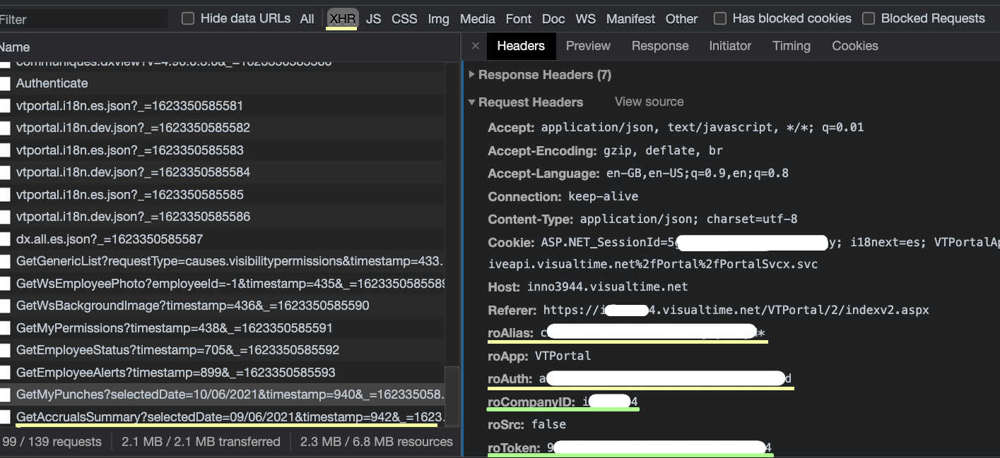

# Auto Visual Time filler

If you are tired to fill each day manually in `visualtime.net/VTPortal/`, you can try this sript.

Did you miss to fill 1 week? Worry not! We are here to help you!

## How to get the credentials

1. In the browser, open the developer tools (usually `F12` keyboard shortcut).
2. Login into Visual Time with your user.
3. Apply the `XHR` filter and click on the latest BE call.
4. The `yellow` elements `changes on each login` meanwhile `green` are always the same.



## How to use

> Important: You should copy the token manually each time you log-in to the app.

1. Download the script (`main.js`) or clone the repo.
2. Modify the `headers` var with your user info (remember, `roAuth` and `roToken` changes on each login) using `How to get the credentials` tutorial.
3. On the `browser console developer` (`F12` or `developer tools`) paste the whole `main.js` content and `press enter` to load the code.
4. See `Commands for register the time` sections, you just can copy-paste the desired one and press enter.
5. Just wait until network does not do any request more.
6. Check that all the time is registered.


## Commands for register the time

### Register only one day

```js
// YEAR-MONTH-DAY
registerDay('2021-05-09);
```


## FAQ

### What happens if I re-register a day/hour?

Visual Time just will reject that petition and you will no have the sabe `hour:minute` registered multiple times for that day.

### What can I do if a day is not correctly registered (missing some time zones)?

Just re-launch the `registerDay` for that day, it will not duplicate any hour.

